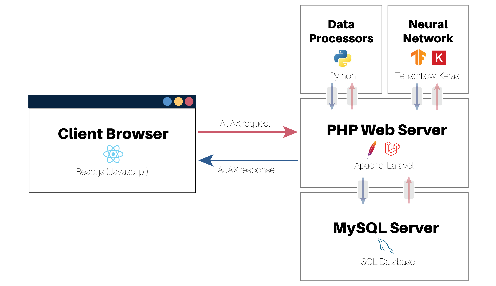

## malDB


## About malDB

malDB is an open-source peptide mass fingerprinting web application that allows the user to create their own peptide database tables to search against. Since malDB is built as a web application, you can use it as either:

- A web server that you access locally on your computer (via 127.0.0.1:8000)
- A web server running on a networked machine (access via <IP_ADDRESS>:8000)

malDB provides the following features:

- Uploading, digesting and storage of any proteome(s) in .fasta format
- Definition of custom mass modifications
- Searching through database tables using experimental mass lists to determine protein identity
- Multi-layer perceptron for predicting a protein's fingerprint based on primary sequence alone
- Additional useful mass spectrometry tools

## Installing malDB on Windows / Linux

Installing malDB involves deploying a Laravel application on a machine that can serve as a webserver. You can run malDB on your own computer but it is recommended that you use a networked machine with a high performance CPU and at least 16GB of RAM.

1. [Download PHP](https://www.php.net/downloads.php) and add the root folder to your PATH so that the php binary is accessible.
2. [Download Composer](https://getcomposer.org/) and install it. Make sure it is added to your PATH. Restart any terminals after installing Composer.
3. [Download node.js](https://nodejs.org/en/) and install it.
4. [Download MySQL](https://dev.mysql.com/downloads/installer/) and install MySQL server and MySQL workbench.
5. In the PHP folder, open php.ini and uncomment the following lines by removing the semicolon:

`;extension=pdo_mysql` => `extension=pdo_mysql` \
`;extension=fileinfo`  => `extension=fileinfo`  

Note that if you don't have a `php.ini` file, you should rename the supplied `php.ini.recommended` or `php.ini.development` or `php.ini.production` to `php.ini`.

6. Open the MySQL workbench, and add a schema to your MySQL database called 'maldb'.
7. Clone this repository.
8. In the repository root, rename `.env.example` to `.env`. Now, open it up and set the appropriate environment variables to connect to the MySQL database (note that this file may be hidden in your filesystem, you may need to show hidden files to see it): 

```
DB_CONNECTION=mysql 
DB_HOST=127.0.0.1 
DB_PORT=3306 
DB_DATABASE=maldb
DB_USERNAME=myAdminUserName
DB_PASSWORD=myPassword
```

9. In a terminal, migrate to the root of the repository folder.
10. Run `composer install --ignore-platform-reqs` (installs PHP dependencies)
11. Run `npm install` (installs javascript dependencies)
12. Run `php artisan key:generate` (generates a key in .env file)
13. Run `php artisan migrate` (creates the database tables)

# Starting malDB

If you are on a Windows machine, you can simply run `maldb.bat` from the project root. This will run a batch script that excecutes the necessary commands to launch the WAN server and start a job queue. Otherwise, you can run:

1. `php artisan serve` (starts a local development server)
2. In a separate console window, run `php artisan queue:work --timeout=0` to start the job queue.

You should now be able to access malDB in a web browser via http://127.0.0.1:8000/

## Useful Information

- To run the server over LAN or WAN, use `php artisan serve --host 0.0.0.0 --port 8000` (or any port of your choosing). Alternatively, you can choose to run this on an Apache or Nginx server.
- The timeout argument specifies how long a queue job should run for before automatically failing. Large proteomes/search space can take a long time on slow machines, so a timeout time of 0 is recommended so these jobs can run overnight.
- Multiple queues can run concurrently by simply running multiple `php artisan queue:work --timeout=0` commands in separate terminal windows. [See Laravel documentation](https://laravel.com/docs/8.x/queues)
- Tutorials on how to use malDB, and how to perform peptide mass fingerprinting are built into the application under the 'Learn' page.

## Architecture



## Digesting a Proteome

## Running a Search